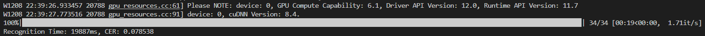
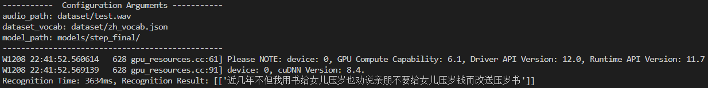

# E2E Chinese Speech Recognition Based on PaddlePaddle2

Tongji SSE 2022Fall | ASR | Final Project

Team Members:

1. 1951138 Wang Mingbang
2. 2050793 Long Huzhiyuan

## 1. Intention

The goal of our project is to develop an end-to-end model for automatic speech recognition(ASR) of Chinese using deep learning. The model would be able to take audio input in the form of spoken Chinese and output a transcription of the words spoken. This could be useful for a variety of applications, such as dictation software, voice-controlled assistants, and accessibility tools for individuals with hearing impairments.

## 2. Related Methods

There are several different methods that have been used for speech recognition, they can be divided into two major categories.

The first is the Gaussian Mixture Model-Hidden Markov Model(GMM-HMM), which uses HMM to model the transition probability of speech state, and uses GMM to model the observation probability of speech state. Before the upsurge of deep learning, GMM-HMM has been the most mainstream and core technology of speech recognition.

Deep learning algorithms, which are a type of machine learning algorithm, have been shown to be effective for speech recognition tasks. These algorithms typically involve training a neural network on a large dataset of labeled speech recordings and then using the trained network to make predictions on new audio inputs. In the past decades, deep learning technology has maintained a rapid development, which also promotes the continuous breakthrough of speech recognition technology. Especially in recent years, end-to-end(E2E) speech recognition solutions have gradually become the focus of the industry.

## 3. Workflow and Functionality

### 3.1 Download Datasets

Firstly, we need to download the public Mandarin speech datasets for training models, and preprocess them. There are 3 optional datasets: `AISHELL`, `free_st_chinese_mandarin_corpus` and `thchs30`.We have wrote scripts to download and process them easily.

Take `thchs_30` as an example.

```python
def create_annotation_text(data_dir, annotation_path):
    if not os.path.exists(annotation_path):
        os.makedirs(annotation_path)
    print('Create THCHS-30 annotation text ...')
    f_a = open(os.path.join(annotation_path, 'thchs_30.txt'), 'w', encoding='utf-8')
    data_path = 'data'
    for file in os.listdir(os.path.join(data_dir, data_path)):
        if '.trn' in file:
            file = os.path.join(data_dir, data_path, file)
            with open(file, 'r', encoding='utf-8') as f:
                line = f.readline()
                line = ''.join(line.split())
            f_a.write(file[:-4] + '\t' + line + '\n')
    f_a.close()
def prepare_dataset(url, md5sum, target_dir, annotation_path):
    """Download, unpack and create manifest file."""
    data_dir = os.path.join(target_dir, 'data_thchs30')
    if not os.path.exists(data_dir):
        filepath = download(url, md5sum, target_dir)
        unpack(filepath, target_dir)
        os.remove(filepath)
    else:
        print("Skip downloading and unpacking. THCHS-30 data already exists in %s." % target_dir)
    create_annotation_text(data_dir, annotation_path)
```

The `create_annotation_text()` function takes two arguments: `data_dir` and `annotation_path`. It creates a new annotation file at the specified `annotation_path` that contains a list of audio file paths and their corresponding transcriptions. The function creates the `annotation_path` directory if it does not already exist, and then iterates over all the files in the `data_dir` directory that have the `.trn` file extension. For each file, it reads the transcription from the file and writes the file path and transcription to the `thchs_30.txt` file in the `annotation_path` directory.

The `prepare_dataset()` function takes four arguments: `url`, `md5sum`, `target_dir`, and `annotation_path`. It downloads and unpacks a dataset from the given `url`, and then creates an annotation file at the specified `annotation_path` using the `create_annotation_text()` function. If the `data_thchs30` directory already exists in the `target_dir`, the function skips the download and unpacking step and just creates the annotation file. The function is useful for preparing a dataset for use in the speech recognition application.

### 3.2 Create Manifest

Then we need to create manifest and vocabulary. The generated files are stored in `dataset/`.

```python
def create_manifest(annotation_path, manifest_path_prefix):
    data_list = []
    durations = []
    for annotation_text in os.listdir(annotation_path):
        annotation_text = os.path.join(annotation_path, annotation_text)
        with open(annotation_text, 'r', encoding='utf-8') as f:
            lines = f.readlines()
        for line in tqdm(lines):
            audio_path = line.split('\t')[0]
            if args.is_change_frame_rate:
                change_rate(audio_path)
            f_wave = wave.open(audio_path, "rb")
            duration = f_wave.getnframes() / f_wave.getframerate()
            durations.append(duration)
            text = is_ustr(line.split('\t')[1].replace('\n', '').replace('\r', ''))
            line = '{"audio_path":"%s", "duration":%.2f, "text":"%s"}' % (audio_path.replace('\\', '/'), duration, text)
            data_list.append(line)
    data_list.sort(key=lambda x: json.loads(x)["duration"], reverse=True)
    f_train = open(os.path.join(manifest_path_prefix, 'manifest.train'), 'w', encoding='utf-8')
    f_test = open(os.path.join(manifest_path_prefix, 'manifest.test'), 'w', encoding='utf-8')
    for i, line in enumerate(data_list):
        if i % 100 == 0:
            f_test.write(line + '\n')
        else:
            f_train.write(line + '\n')
    f_train.close()
    f_test.close()
```

`create_manifest()` creates a manifest file that contains a list of audio file paths and their corresponding transcriptions. The manifest file is used to train and evaluate a speech recognition model. The function takes two arguments: `annotation_path` and `manifest_path_prefix`. It iterates over all the files in the `annotation_path` directory, reads the audio file paths and transcriptions from each file, and writes them to a manifest file. The manifest file is created in the `manifest_path_prefix` directory, and the function creates two files: `manifest.train` and `manifest.test`, which contain the training and test data, respectively.

```python
counter = Counter()
count_manifest(counter, args.manifest_path)
count_sorted = sorted(counter.items(), key=lambda x: x[1], reverse=True)
with open(args.vocab_path, 'w', encoding='utf-8') as fout:
    labels = ['?']
    for char, count in count_sorted:
        if count < args.count_threshold: break
        labels.append(char)
    fout.write(str(labels).replace("'", '"'))
```

These lines of code creates a vocabulary file at the specified `vocab_path` that maps each character in the counter dictionary to an integer index. This vocabulary file is used to encode and decode the transcriptions in the dataset.

### 3.3 Train the Model

After the preprocessing, we can start to train!

We only uses convolutional neural network, without other special network structures. The model is simple and understandable, and it is end-to-end. No audio alignment is required, because the project uses CTC Loss as the loss function. In the traditional model of speech recognition, before training the speech model, we often have to strictly align the text and speech. This alignment is a waste of time. Moreover, after alignment, the predicted label of the model is only the result of local classification, and it is impossible to give the output result of the whole sequence. We often need to do some post-processing on the predicted label to get the final result we want. Using CTC(Connectionist temporal classification) as the loss function does not require audio alignment, the direct input is a complete voice data, and the output is the entire sequence result.

In terms of convenient data preprocessing, this project implements Mel Frequency Cepstrum Coefficients (MFCCs) processing for audio, and then use the data for training. The sampling rate of all audio used in this project is 16000Hz. If the audio with other sampling rates needs to be converted to 16000Hz, `create_manifest.py` also provides functions to convert the audio to 16000Hz.

The code is too long to paste here. You can view it in `train.py`.

## 4. Performance Evaluation

After 50 epochs of training (using about 45 hours), the `loss` and `character error rate`(cer) decreased significantly and stabilized near a certain value. The final train loss is approximately 0.25, and the final test cer is approximately 7.8%.


We can use `eval.py` to evaluate the trained model, and use `infer.py` to perform speech recognition on audio files.





## 5. Advantages and Disadvantages

One advantage of using a deep learning approach for ASR is that the model can learn from the data and improve its predictions over time. Additionally, a deep learning model can handle a large number of input variables, which may be necessary for accurately transcribing Chinese speech. On the other hand, a disadvantage of this approach is that it requires a large amount of labeled data for training, which can be difficult and time-consuming to obtain.

In the project, we use greedy strategy decoder, but not cluster search decoder for sequence decoding. Compare with cluster search decoder, the advantage of greedy strategy decoder is that its implementation is relatively simple, and it can complete decoding in linear time. This means that it can work well in real-time applications. However, because greedy algorithm only considers the current situation, it is difficult to find the global optimal solution in the sequence. Therefore, the result of the greedy strategy decoder is usually not optimal.
